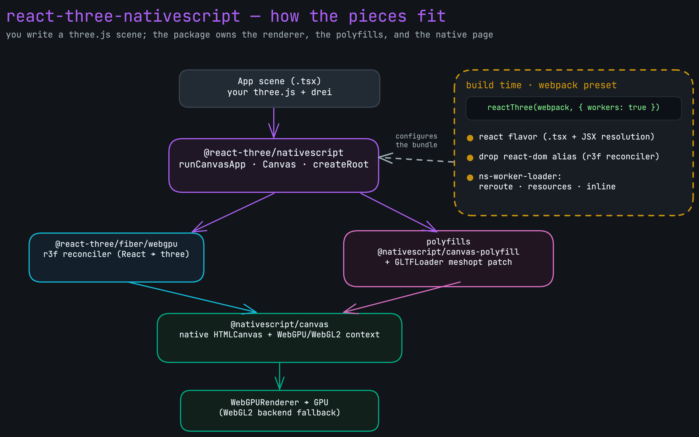
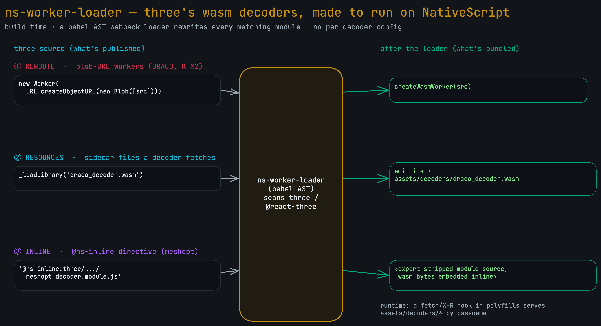
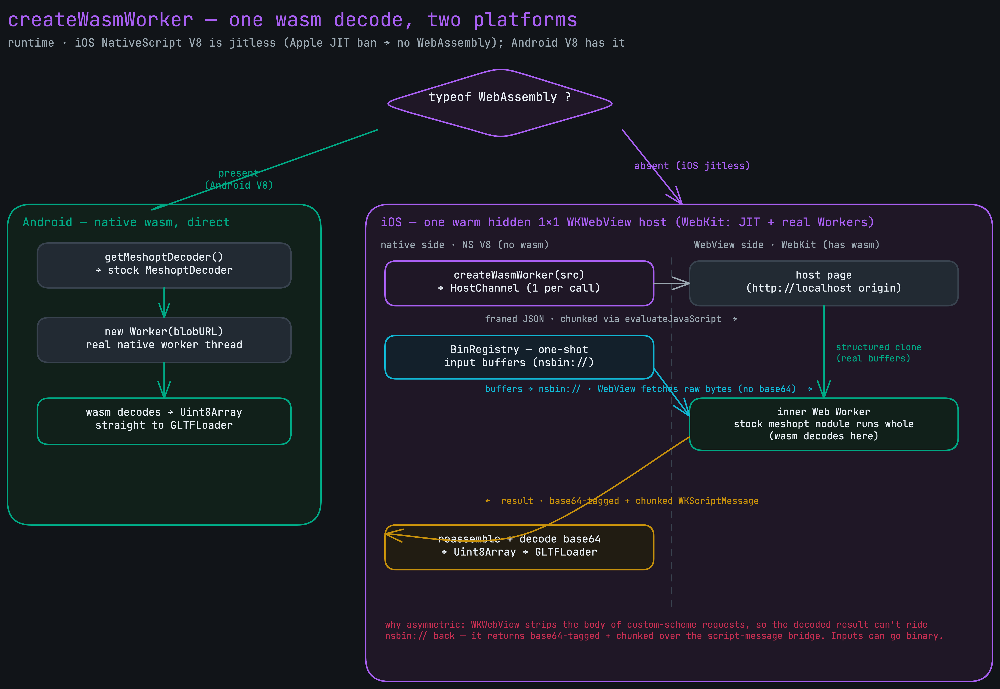

# react-three-nativescript

NativeScript bindings for [@react-three/fiber](https://github.com/pmndrs/react-three-fiber). Write a three.js scene as React, run it native on iOS and Android through `@nativescript/canvas`, render it with WebGPU.

This is a technical preview, meant to be iterated on and eventually folded into the broader react-three and NativeScript ecosystems. The package keeps its real name, `@react-three/nativescript`, but it's marked `private: true`, so nothing publishes from here yet. It runs against the published `@react-three/fiber` alpha and ships a working demo plus a starter template, with the build and release wiring laid out in one place so it's easy to pick apart.

## What's in here

```
react-three-nativescript/
├── packages/nativescript/   @react-three/nativescript — the bindings (private:true)
├── examples/suzi/        the full demo: WebGPU, HDR env, contact shadows, a meshopt model
├── template/                 a minimal starter you scaffold with `ns create`
└── docs/wasm-loader/         the diagrams below
```

pnpm workspace, unbuild for the package, vitest for the package tests, prettier for format. Same toolchain react-three-fiber uses, minus the parts that don't apply to one binding.

## Quick start

The template is the fast path. NativeScript scaffolds a new app straight from it:

```bash
ns create my-app --template ./template
cd my-app
ns run ios      # or: ns run android
```

You get a bare scene, a lit mesh you can orbit, with the whole decoder/worker pipeline already wired in webpack. Drop a compressed `.glb` in `app/assets`, load it with `useGLTF('~/assets/your-model.glb')`, and it works, no extra config.

Note: `@react-three/nativescript` isn't published to npm yet, so a clean `ns create` against the template won't install it until the package ships. Inside this repo it resolves to the local workspace package, so the template builds and runs here today.

## Working in the repo

```bash
pnpm install
pnpm build        # build the package (unbuild → dist)
pnpm test         # package vitest suite
pnpm typecheck    # package + example + template
pnpm format       # prettier
```

Then run the demo:

```bash
cd examples/suzi
ns run ios        # or: ns run android
```

NativeScript wants a flat node_modules and uses pnpm as the package manager here (`ns package-manager set pnpm`). The `.npmrc` sets `shamefully-hoist=true` so the CLI's implicit requires and the iOS plugin Podfiles both resolve. There be dragons in NativeScript + pnpm; that one line is what tames them.

## Using the package

```tsx
import { runCanvasApp } from '@react-three/nativescript'
import { Scene } from './scene'

runCanvasApp(<Scene />, {
  camera: { position: [0, 0, 4], fov: 45 },
  page: { backgroundColor: '#15161a' },
})
```

`runCanvasApp` owns the WebGPU renderer setup, the GLTF/decoder polyfills, and the NativeScript page. You write three.js. The surface:

- `runCanvasApp(element, props)` boots a fullscreen canvas app
- `createCanvasPage(element, props)` returns a `Page` for multi-screen apps
- `Canvas(view, props)` / `createRoot(view, props)` are the low-level bootstrap
- `createWasmWorker`, `preloadWasmHost`, `patchGLTFLoader` are the wasm primitives, used for you by the high-level entries
- everything from `@react-three/fiber/webgpu` is re-exported, so r3f hooks come from the same import

The webpack config is two lines on top of NativeScript's:

```js
const webpack = require('@nativescript/webpack')
const reactThree = require('@react-three/nativescript/webpack')
module.exports = (env) => {
  webpack.init(env)
  reactThree(webpack, { workers: true })
  return webpack.resolveConfig()
}
```

## How it fits together

You write a scene. The package puts the r3f reconciler on top of `@nativescript/canvas`, installs the polyfills three's loaders expect, and hands the canvas a WebGPU context (WebGL2 if WebGPU isn't there). The webpack preset is the build-time half: it turns the react flavor on, drops the react-dom alias because r3f runs its own reconciler, and registers the worker loader.



## The wasm loader, and why it exists

three's GLTF decoders, DRACO, KTX2, meshopt, are wasm. That's the whole problem. iOS NativeScript runs a jitless V8, Apple bans the JIT, so `WebAssembly` is gone on iOS. Android's V8 has it. One codebase, two completely different runtime stories, and the build has to feed both.

### Build time: ns-worker-loader

A babel-AST webpack loader rewrites three's decoder modules so they run on NativeScript, with zero per-decoder config. Three jobs:

- **reroute** the blob-URL workers DRACO and KTX2 build (`new Worker(URL.createObjectURL(new Blob([src])))`) into `createWasmWorker(src)`, which runs the same source through the bridge
- **resources**: find the sidecar files a decoder fetches by bare name (`draco_decoder.wasm`), resolve them from the package's `libs/`, and emit them to `assets/decoders/`, served at runtime by basename
- **inline**: replace an `@ns-inline:<module>` string literal with that module's export-stripped source, wasm bytes and all. That's the meshopt path, the one decoder whose wasm is embedded in JS and has to run whole inside a worker.



### Runtime: createWasmWorker, one decode, two platforms

`createWasmWorker` branches on `typeof WebAssembly`. Android has it, so you get a real native `Worker` and the stock decoder, decoding straight off-thread. Done.

iOS has no wasm, so it runs the decoder inside WebKit. WebKit has the JIT entitlement and real Workers. Instead of a WKWebView per worker, there's one hidden 1×1 WKWebView host, kept warm, and every `createWasmWorker` is a channel that spawns a real Web Worker inside it. The stock meshopt module runs whole in there, where wasm is alive.

The transport is asymmetric on purpose. The script-message bridge is JSON only, so on the way in, buffers ride a `nsbin://` URL scheme the WebView fetches as raw bytes, no base64, while the small JSON frame goes through `evaluateJavaScript` in chunks. On the way back, the decoded result can't use the scheme, WKWebView strips the body off custom-scheme requests, so it returns base64-tagged and chunked over the script-message bridge. Inputs go binary, the result stays base64. The directionality of the platform decides it, not preference.



## What's verified

CI runs install, build, typecheck, the vitest suite, and a prettier check on every push (`.github/workflows/test.yml`). All green.

On a device, here's where it actually stands:

- **iOS** (iPhone 16 simulator, iOS 18.5): runs. WebGPU acquires a device and renders the demo at 60 fps, the meshopt model decodes through the WKWebView wasm bridge, no errors. The full pipeline, end to end.
- **Android** (Pixel 9 emulator): builds, installs, launches, and the JS pipeline runs clean, decoders copied and redirected, polyfills up, WebGL2 fallback chosen because the emulator has no WebGPU. Then the emulator's software GPU aborts in the native canvas GL layer (`SIGABRT` out of Mesa virtio-gpu). That's an emulator-GPU limit, not the bindings; the JS ran identically to iOS up to the renderer. A physical Android device is the call to confirm the render.

`release.yml` is reference-only. The package is `private: true`, so it builds and packs the tarball that _would_ ship and stops there. The real publish line is in the workflow comments.
